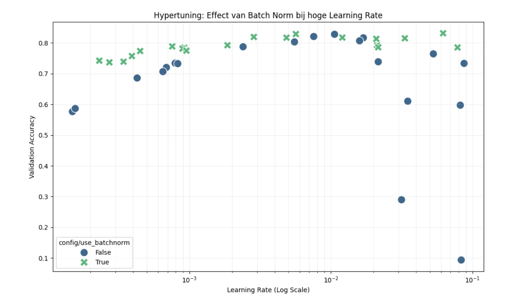

# Summary week 4
## CNN Optimization with Ray Tune
<<<<<<< HEAD

In this experiment I optimized a Convolutional Neural Network (CNN) for the gestures dataset. The goal was to investigate the relationship between learning rate and batch optimization,

## 1. Hypothesis
I hypothesize that models with Batch Normalization will remain stable and achieve high accuracy even at high learning rates (e.g., > 0.01), whereas models without Batch Normalization will fail (diverge) at those same high learning rates due to internal covariate shift.

## 2. Methodology
I used ray tune to perform a hyperparameter search.
Algorithm: random search combined with grid search for batch norm.
Samples: 20 runs.
Search Space:
    * `Batch Normalization`: [True, False] (Grid Search)
    * `Learning Rate`: 1e-4 to 1e-1 (LogUniform)

## 3. Results
The visualization below shows the Validation Accuracy (Y-axis) against the Learning Rate (X-axis).

* At lower learning rates (left side), both models perform well.
* As the learning rate increases beyond $10^{-2}$, the models without batch norm (blue circles) crash significantly, dropping to ~10% accuracy (random guessing).
* The models with batch norm** (green crosses) maintain high accuracy (~80%) even at the highest learning rates tested.

## 4. Conclusion
The experiment confirms my hypothesis. The visual clearly demonstrates that batch normalization acts as a stabilizer. It allows the neural network to be trained with much higher learning rates without diverging.

For future CNN architectures, I recommend always including batch normalization layers. They make the training process more robust and less sensitive to the specific choice of the learning rate.
=======
>>>>>>> e470013d2ab235742c27cfe197edf90a5e78928a

In this experiment I optimized a Convolutional Neural Network (CNN) for the gestures dataset. The goal was to investigate the relationship between learning rate and batch optimization,

## 1. Hypothesis
I hypothesize that models with Batch Normalization will remain stable and achieve high accuracy even at high learning rates (e.g., > 0.01), whereas models without Batch Normalization will fail (diverge) at those same high learning rates due to internal covariate shift.

## 2. Methodology
I used ray tune to perform a hyperparameter search.
Algorithm: random search combined with grid search for batch norm.
Samples: 20 runs.
Search Space:
    * `Batch Normalization`: [True, False] (Grid Search)
    * `Learning Rate`: 1e-4 to 1e-1 (LogUniform)

## 3. Results
The visualization below shows the Validation Accuracy (Y-axis) against the Learning Rate (X-axis).

* At lower learning rates (left side), both models perform well.
* As the learning rate increases beyond $10^{-2}$, the models without batch norm (blue circles) crash significantly, dropping to ~10% accuracy (random guessing).
* The models with batch norm** (green crosses) maintain high accuracy (~80%) even at the highest learning rates tested.

## 4. Conclusion
The experiment confirms my hypothesis. The visual clearly demonstrates that batch normalization acts as a stabilizer. It allows the neural network to be trained with much higher learning rates without diverging.

For future CNN architectures, I recommend always including batch normalization layers. They make the training process more robust and less sensitive to the specific choice of the learning rate.
Here are the [instructions](./instructions.md) and here is a script to start [hypertune.py](./hypertune.py)

[Go back to Homepage](../README.md)
